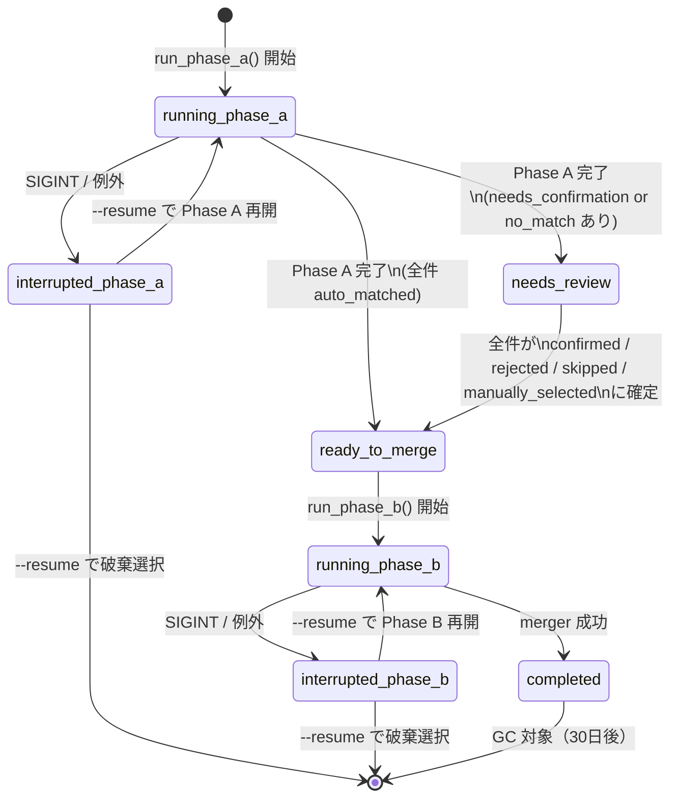

# ADR-010: 人間確認ステップの状態遷移とセッション永続化

## ステータス
**Accepted (2026-04-20)**

## コンテキスト

ADR-008（OCR バックエンド）で定義したパイプライン `split → OCR → match → merge` に対し、以下の運用要件が追加された（PRD 更新 2026-04-20）:

1. OCR 抽出結果と B/C ファイル名の照合が曖昧（例: 漢字誤記「美喜子」vs「美貴子」）な場合、**人間が承認するまで結合しない**
2. 20名処理中に中断（電源断、誤操作）しても**再開可能**であること
3. 運用者が「承認した誤記ペア」を確認できること（監査要件）

これにより、従来の1発バッチ実行から **2フェーズ + 明示的な状態管理** へと設計が変わる。

CLAUDE.md の MUST ルール:
> statusフィールドで処理状態を管理する設計 → 状態遷移図を先に作成

## 決定

### セッションモデル

1 回の実行 = 1 セッション。`<output_dir>/.sessions/<session_id>.json` として永続化する。

- `session_id`: ISO 8601 UTC 秒 + ランダム4文字（例: `20260420T001523Z-a1b2`）
- GC ポリシ: 30日経過した `completed` セッションは次回起動時に自動削除
- スキーマバージョン付与（`schema_version: 1`）で将来の後方互換性を確保

### 状態遷移図



### 状態定義

| セッション状態 | 意味 | 遷移先 |
|--------------|------|-------|
| `running_phase_a` | splitter → OCR → matcher 実行中 | needs_review / ready_to_merge / interrupted_phase_a |
| `needs_review` | UI での人間確認待ち | ready_to_merge |
| `ready_to_merge` | 全ペア確定、merger 実行可能 | running_phase_b |
| `running_phase_b` | merger 実行中 | completed / interrupted_phase_b |
| `completed` | 結合 PDF 出力完了 | （GC 対象） |
| `interrupted_phase_a` | Phase A 実行中の中断 | running_phase_a（再開）or 破棄 |
| `interrupted_phase_b` | Phase B 実行中の中断 | running_phase_b（再開）or 破棄 |

### ペア（UserPageCandidate）の状態

各利用者ページに紐づく状態。

| ペア状態 | 意味 | 発生元 |
|---------|------|-------|
| `auto_matched` | matcher が自動で対応B/C確定 | Phase A 自動判定 |
| `needs_confirmation` | 類似候補あり、人間確認必要 | Phase A（Levenshtein ≤ 2 等） |
| `no_match` | 該当 B/C ファイル無し | Phase A |
| `confirmed` | UI で承認済み（auto_matched 相当に昇格） | UI 操作 |
| `rejected` | UI で却下（B/C 欠損として扱う） | UI 操作 |
| `manually_selected` | UI で別ファイルを手動選択 | UI 操作 |
| `skipped` | UI でスキップ（そのページを結合対象から除外） | UI 操作 |

`ready_to_merge` 到達条件: 全ペアが `auto_matched` / `confirmed` / `rejected` / `manually_selected` / `skipped` のいずれか。

### 類似候補の提示ポリシー

`needs_confirmation` 時に保存される `similar_candidates` は、B と C を合算したうえで
（距離, kind, 抽出名）昇順に並べ、先頭 3 件を採用する。これは「距離が近いペアを優先的に
UI に提示する」方針を優先し、種別バランス（B と C を各 N 件ずつ）よりも距離優先で
スペースを割り当てるため。`iterdir()` 順は `sorted()` で決定論化する。

同姓同名ファイル（事故的な命名）が検出された場合、完全一致は「最初に見つかった 1 件」を
採用し、他候補は無視する（`iterdir()` を `sorted()` で昇順走査しているため決定論）。

### フリガナ照合について（本バージョンでは未対応）

本 ADR バージョンの照合は漢字ファイル名ベースのみ。フリガナ照合は B/C PDF 生成機能
（将来実装）で B/C ファイル命名規則が確定した時点で追加する。

### JSON スキーマ（Session v1）

```json
{
  "schema_version": 1,
  "session_id": "20260420T001523Z-a1b2",
  "status": "needs_review",
  "created_at": "2026-04-20T00:15:23Z",
  "updated_at": "2026-04-20T00:16:45Z",
  "config_snapshot": {
    "input_dir": "...",
    "output_dir": "...",
    "concat_order": ["A", "B", "C"],
    "source_d_filename": "common.pdf"
  },
  "source_a_path": "input/A.pdf",
  "candidates": [
    {
      "page_index": 0,
      "user_name_ocr": "塩津 美喜子",
      "confidence": "high",
      "status": "auto_matched",
      "matched_b_path": "input/B_塩津美喜子.pdf",
      "matched_c_path": "input/C_塩津美喜子.pdf",
      "similar_candidates": []
    },
    {
      "page_index": 1,
      "user_name_ocr": "塩津 美貴子",
      "confidence": "medium",
      "status": "needs_confirmation",
      "matched_b_path": null,
      "matched_c_path": null,
      "similar_candidates": [
        {"path": "input/B_塩津美喜子.pdf", "distance": 1, "kind": "B"},
        {"path": "input/C_塩津美喜子.pdf", "distance": 1, "kind": "C"}
      ]
    }
  ],
  "a_page_pdf_bytes_dir": ".sessions/20260420T001523Z-a1b2-pages/",
  "output_path": null
}
```

- **`a_page_pdf_bytes_dir`**: splitter が出力した per-page PDF を退避するディレクトリ。中断後の再開で再 split を避けるためバイナリを保持（OCR 結果と紐付けて格納）
- **`config_snapshot`**: 再開時に config が変わっていても整合性を保つため、初回実行時のスナップショットを保存
- **暗号化**: 氏名を含むため機密性ある。セッションファイルは `<output_dir>/.sessions/` に配置し、`.gitignore` で明示除外。追加暗号化は当面なし（ローカル1PC運用前提、ADR-002）

### アトミック書込

- `json.dumps` → `tempfile.mkstemp` → `os.replace` のパターン
- Windows の非同期フラッシュ問題に対処するため `os.fsync` をファイル close 前に実行

### 同時実行制御

- 1セッション = 1プロセス前提
- Phase A 実行中に同一 session_id を別プロセスが触ると破損リスク → セッションディレクトリ内 `lock` ファイル（`msvcrt.locking` / `fcntl.flock`）で排他
- 本機能の利用頻度（月数回）から、シンプルな排他ロックで十分と判断

## 代替案と却下理由

| 案 | 却下理由 |
|----|---------|
| **SQLite でセッション管理** | 過剰。月数回の利用規模でスキーマ管理・マイグレーション負担不要。JSON で十分 |
| **1セッション = 1ファイル（候補もフラットに）** | 採用（上記設計） |
| **候補ごとに別ファイル** | ファイル数爆発。アトミック更新が困難 |
| **永続化なし（メモリのみ）** | 中断・再開要件を満たせない |
| **暗号化必須** | ローカル1PC前提（ADR-002）では YAGNI。クラウド同期やマルチ施設化時に再検討 |

## 影響

- **新規ファイル**: `src/wiseman_hub/pdf/session.py`
- **.gitignore 追加**: `output_dir/.sessions/`（プロジェクトの output_dir 例に対して）
- **CLI 追加オプション**: `--resume <session_id>`, `--list-sessions`, `--discard <session_id>`
- **ログ**: セッション遷移ごとに `logger.info` で状態と session_id 記録（監査証跡）

## スコープ外（将来対応）

- 誤記ペア学習辞書（2回目以降の自動承認）→ Phase 2 機能
- リモートセッション共有（複数施設展開時）
- セッションファイル暗号化（マルチユーザー環境時）
- Web UI による過去セッション閲覧

## 関連

- ADR-008: OCR バックエンド（状態遷移の起点となる OCR confidence 定義）
- ADR-009: UI 技術選定（本状態遷移を操作する Tkinter UI）
- CLAUDE.md MUST ルール: statusフィールド管理時の状態遷移図先行
