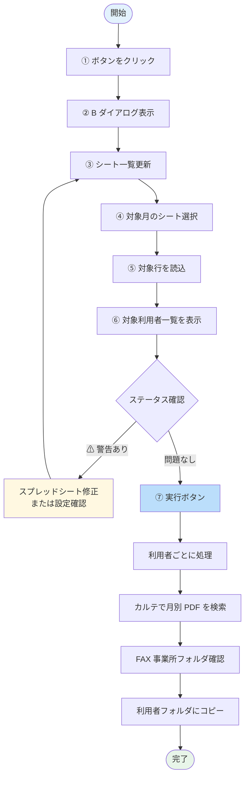

# ② B: 運動機能向上計画書 自動配置

スプレッドシートの月別データを元に、運動機能向上計画書（B 帳票）の PDF を利用者フォルダに自動配置します。

## 何のための機能か

  

    
📊

    
<strong>スプレッドシート</strong> 月別モニタリング対象

  

  
➜

  

    
📁

    
<strong>カルテ</strong> 月別 PDF を取得

  

  
➜

  

    
📂

    
<strong>FAX 事業所</strong> 利用者フォルダに配置

  

- 月ごとの **モニタリング対象利用者** を Google スプレッドシートで管理
- 対象利用者ごとに、**カルテから月別 PDF をコピー** し、FAX 事業所フォルダ内の利用者フォルダに配置
- 手作業だと「該当月の対象者を探す → カルテで該当 PDF を探す → 利用者フォルダにコピー」を利用者数だけ繰り返す必要がある作業を自動化

---

## 処理フロー

---

## 操作手順

  1<strong>ボタンをクリック</strong> 
  メイン画面の <strong>「② B: 運動機能向上計画書 自動配置」</strong> ボタンをクリック。

  2<strong>ダイアログが開く</strong> 
  「B ダイアログ」が開きます。

  3<strong>🔄 シート一覧を更新</strong>（初回または最新化したい時） 
  ダイアログ上部の <strong>「シート一覧更新」</strong> ボタンをクリック。スプレッドシートから最新の月別タブ一覧が取得されます。

  4<strong>対象月のシートを選択</strong> 
  ドロップダウンから対象月（例: <code>2026-05</code>）を選びます。

  5<strong>📥 対象行を読込</strong> 
  <strong>「対象行を読込」</strong> ボタンをクリック。 
  選択した月のシートから、<strong>モニタリング日付がある行</strong>（=配置対象の利用者）が抽出されます。

  6<strong>内容を確認</strong> 
  一覧テーブルで対象利用者と状態を確認します。

| 表示項目 | 意味 |
|---------|------|
| 利用者名 | 配置対象の利用者 |
| 居宅 | 紐付け先の居宅介護支援事業所 |
| 月別 PDF | カルテから探し出した該当月の PDF |
| ステータス | 「実行待ち」「成功」「⚠ ○○未登録」等 |

特に「⚠」マーク付きの行は **配置不能** または **要注意** の状態です。

  7<strong>▶️ 実行</strong> 
  問題なければ、右下の <strong>「実行」</strong> ボタンをクリック。 
  ステータスが「実行待ち」→「成功」に更新されていきます。

  8<strong>結果を確認</strong>

| ステータス | 意味 | 対応 |
|-----------|------|------|
| ✓ 成功 | 配置完了 | OK |
| ⚠ 居宅マッピング未登録 | 利用者の居宅が判定できない | スプレッドシートに居宅を追記 |
| ⚠ 利用者フォルダ未発見 | FAX 事業所フォルダ内に利用者フォルダがない | フォルダ作成 |
| ⚠ 月別 PDF 不在 | カルテに該当月の PDF がない | カルテ側で出力確認 |
| ⚠ 候補複数 | 同名の月別 PDF が複数あり判定不能 | カルテ整理 |
| ✗ エラー | システムエラー | 開発担当へ連絡 |

  9<strong>閉じる</strong> 
  完了したら <strong>「閉じる」</strong> ボタンでダイアログを閉じます。

---

## 共通の操作ボタン

| ボタン | 役割 |
|--------|------|
| 🔄 シート一覧更新 | スプレッドシートから最新のシート一覧を再取得 |
| 📥 対象行を読込 | 選択中のシートから対象行を抽出 |
| ⚙️ 設定... | スプレッドシート ID 等の設定変更 |
| ▶️ 実行 | 表示中の全対象行に対して配置を実行 |
| 閉じる | ダイアログを閉じる |

---

## よくある質問

> **Q. 「シート一覧更新」と「対象行を読込」の違いは？**  
> A. 前者は **月のタブ一覧** を取りに行く（数か月に 1 度）。後者は **その月のシート内の利用者行** を取りに行く（実行ごと）。

> **Q. ⚠ マークの行を無視して実行できる？**  
> A. ⚠ の行は実行時に **自動的にスキップ** されます。エラーにはなりません。

> **Q. 設定変更後の挙動は？**  
> A. 「設定...」でスプレッドシート ID を変更した場合、自動的にシート一覧と対象行がクリアされます。「シート一覧更新」からやり直してください。

---

## 関連

- スプレッドシート ID、月別 PDF の取得元パス等は **[⑤ 設定](settings.md)** から変更できます
- ⚠ マークが大量に出る → [トラブルシューティング](../troubleshooting.md)
- スプレッドシートが見つからない → [FAQ](../faq.md)
