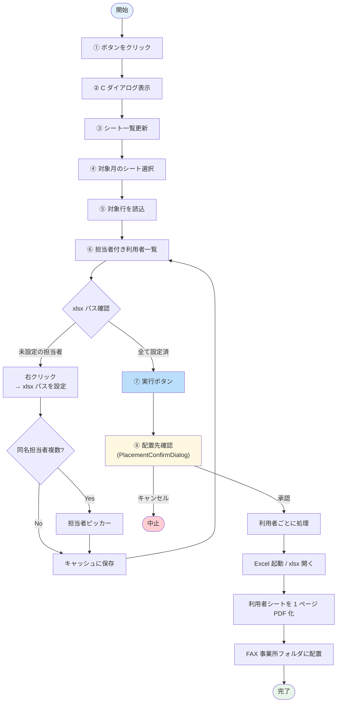

# ③ C: 経過報告書 自動配置

スプレッドシートの担当者情報を元に、経過報告書（C 帳票）の xlsx を PDF 化して事業所フォルダに自動配置します。

## 何のための機能か

  

    
📊

    
<strong>スプレッドシート</strong> 担当者付き利用者

  

  
➜

  

    
📗

    
<strong>担当者の xlsx</strong> 利用者シートを抽出

  

  
➜

  

    
📄

    
<strong>Excel PDF 化</strong> 1 ページ目のみ

  

  
➜

  

    
📂

    
<strong>FAX 事業所</strong> 配下に配置

  

- 月ごとの **担当者付き利用者** を Google スプレッドシートで管理
- 担当者ごとに保存されている **経過報告書 xlsx ファイル** から、対象利用者のシートだけを PDF 化
- 生成された PDF を FAX 事業所フォルダ配下に自動配置

---

## 処理フロー

---

## 操作手順

  1<strong>ボタンをクリック</strong> 
  メイン画面の <strong>「③ C: 経過報告書 自動配置」</strong> ボタンをクリック。

  2<strong>ダイアログが開く</strong> 
  「C ダイアログ」が開きます。

  3<strong>🔄 シート一覧を更新</strong> 
  上部の <strong>「シート一覧更新」</strong> ボタンをクリック。

  4<strong>対象月のシートを選択</strong> 
  ドロップダウンから対象月を選択。

  5<strong>📥 対象行を読込</strong> 
  <strong>「対象行を読込」</strong> ボタンをクリック。担当者が記入されている行が抽出されます。

  6<strong>内容を確認</strong>

| 表示項目 | 意味 |
|---------|------|
| 利用者名 | 配置対象の利用者 |
| 担当者 | 経過報告書を作成した担当者 |
| xlsx パス | 担当者の経過報告書 xlsx ファイルパス |
| ステータス | 「実行待ち」「成功」等 |

---

## ✨ C 機能特有: xlsx パス設定

初回や担当者交代後、**担当者 → xlsx パス** が未登録の場合があります。  
該当行は ⚠ xlsx パス未設定 と表示されます。

### xlsx パスの設定方法

  <strong>1.</strong> 該当行を <strong>ダブルクリック</strong> または <strong>右クリック → 「xlsx パスを設定」</strong> 
  <strong>2.</strong> <strong>xlsx ピッカー</strong> が開くので、担当者の経過報告書 xlsx ファイルを選択 
  <strong>3.</strong> 一度設定すれば、次回以降は <strong>キャッシュされて自動利用</strong> されます

### 同名担当者が複数いる場合

姓だけ一致する別人が複数いる場合、**担当者ピッカー** が開きます。

- 該当する担当者を一覧から選択してください
- 選択結果はキャッシュされ、次回以降は自動選択されます

---

## 実行と配置先確認

  7<strong>▶️ 実行</strong> 
  <strong>「実行」</strong> ボタンをクリック。

  8<strong>配置先確認ダイアログ</strong> 
  実行前に <strong>配置先確認ダイアログ（PlacementConfirmDialog）</strong> が表示されます。
  <ul>
    <li>配置先パス、ファイル名を確認</li>
    <li>問題なければ <strong>「承認」</strong> をクリック</li>
    <li>上書き等の懸念があれば <strong>「キャンセル」</strong></li>
  </ul>

  9<strong>結果を確認</strong>

| ステータス | 意味 | 対応 |
|-----------|------|------|
| ✓ 成功 | 配置完了 | OK |
| ⚠ xlsx パス未設定 | 担当者の xlsx パスが未登録 | xlsx ピッカーで設定 |
| ⚠ 利用者シート不在 | xlsx 内に利用者名のシートがない | xlsx 確認 |
| ⚠ 事業所フォルダ不在 | FAX 事業所フォルダがない | フォルダ作成 |
| ✗ エラー | システムエラー | 開発担当へ連絡 |

---

## C 機能特有の仕組み

### 🔄 xlsx パスキャッシュ

担当者 → xlsx パスの対応は **ローカルキャッシュ** + **GCS ミラー** で管理されています。

- 一度設定したパスは、ローカルにキャッシュされ高速利用
- GCS にも自動アップロードされるので、別 PC からも参照可能（マルチ端末対応）

### 📊 Excel COM による PDF 化

経過報告書 xlsx は **Microsoft Excel の COM 経由** で 1 シートずつ PDF 化されます。

> **注意**: 実行中は Excel が裏で起動します（自動制御、画面には出ません）。  
> Excel がインストールされていないと動作しません。

---

## よくある質問

> **Q. 担当者の xlsx パスを変更したい**  
> A. 該当行を右クリック → 「xlsx パスを設定」で再選択できます。

> **Q. xlsx ファイルが開かれている時に実行できる？**  
> A. 開かれていると **エラー** になります。実行前に閉じてください。

> **Q. Excel が複数起動して困る**  
> A. ツールが自動起動した Excel は実行完了後に終了します。手動で開いていた Excel には影響しません。

---

## 関連

- スプレッドシート ID、担当者マッピング等は **[⑤ 設定](settings.md)** から変更できます
- Excel が起動しない → [トラブルシューティング](../troubleshooting.md)
- 担当者ピッカーで該当者がいない → [FAQ](../faq.md)
