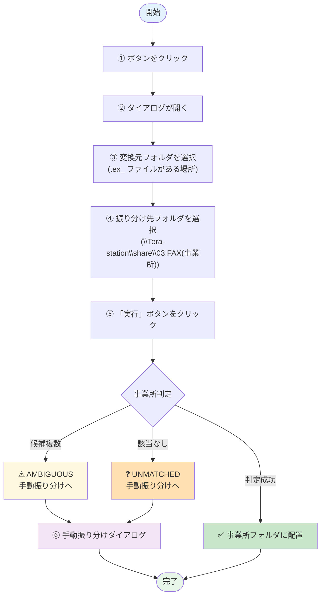

# ① ex_ファイル変換 + 振り分け

Wiseman から出力した `.ex_` ファイルを PDF に変換し、事業所フォルダに自動で振り分けます。

## 何のための機能か

  

    
📁 .ex_ ファイル

    
Wiseman 出力 そのままでは開けない

  

  
➜

  

    
📄 PDF + 事業所別振り分け

    
事業所フォルダ配下に配置

  

- Wiseman の `.ex_` ファイルは **そのままではブラウザや PDF ビューアで開けません**
- このツールで **PDF に変換** + **事業所別のフォルダに振り分け** を一度に行います
- 振り分けが自動でできなかったファイル（事業所判定が曖昧/不明）は、後で **手動振り分けダイアログ** で処理します

---

## 処理フロー

---

## 操作手順

  1<strong>ボタンをクリック</strong> 
  メイン画面の <strong>「① ex_ ファイル変換 + 振り分け」</strong> ボタンをクリックします。

  2<strong>ダイアログが開く</strong> 
  「ex_ ファイル変換」ダイアログが開きます。

  3<strong>変換元フォルダを選択</strong> 
  <code>.ex_</code> ファイルが入っているフォルダ（通常は Wiseman の出力先フォルダ）を選択します。

  4<strong>振り分け先フォルダを選択</strong> 
  PDF 振り分け先のルートフォルダを選択します。 
  通常は <strong><code>\\Tera-station\share\03.FAX(事業所)</code></strong> を選びます。

  5<strong>「実行」ボタンをクリック</strong> 
  実行が始まると、進捗バーが表示されます。

  6<strong>結果を確認</strong> 
  実行が終わると、以下のサマリが表示されます。

| ステータス | 意味 |
|---|------|
| 成功 N 件 | 事業所が判定でき、振り分け完了 |
| AMBIGUOUS N 件 | 複数の事業所候補があり、判定不能（手動振り分けが必要） |
| UNMATCHED N 件 | 該当する事業所がなく、振り分け不能（手動振り分けが必要） |

  7<strong>手動振り分け（必要に応じて）</strong> 
  AMBIGUOUS / UNMATCHED があった場合、<strong>「手動振り分け」ダイアログ</strong> が自動で開きます。 
  ファイル名と内容を確認しながら、正しい事業所を選択してください。

---

## よくある質問

> **Q. `.ex_` ファイルの拡張子は何？**  
> A. Wiseman 独自の拡張子です。中身は PDF データなので、このツールで `.pdf` に変換できます。

> **Q. 同じファイルを 2 回処理してしまったら？**  
> A. 既に振り分け済みのファイルは **重複チェック** で検出され、上書きは抑制されます。

> **Q. 振り分け先フォルダは固定？**  
> A. 振り分け先は実行のたびに選び直せます。ただし通常は **FAX 事業所フォルダ** を使います。

---

## 関連

- 事業所の判定ルール（alias 設定）は **[⑤ 設定](settings.md)** から変更できます
- 振り分け結果が想定と違う → [トラブルシューティング](../troubleshooting.md)
- 手動振り分け中に困った → [FAQ](../faq.md)
