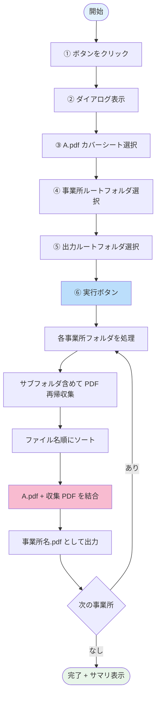
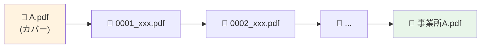

# ④ 事業所フォルダ一括結合

FAX 事業所フォルダ配下の PDF を、事業所ごとに 1 つの PDF に結合します。

## 何のための機能か

  

    
📁📄📄📄

    
<strong>事業所フォルダ</strong> 複数 PDF が散在

  

  
➜

  

    
📑

    
<strong>事業所別の結合 PDF</strong> FAX 送信用 1 ファイル

  

- ① ex_変換 / ② B 配置 / ③ C 配置 の結果、事業所フォルダには複数の PDF が散らばっています
- FAX 送信時は **事業所ごとに 1 つの PDF にまとめて送る** のが効率的
- このツールで **事業所単位の PDF 結合** を一括実行できます

---

## 処理フロー

---

## 操作手順

  1<strong>ボタンをクリック</strong> 
  メイン画面の <strong>「④ 事業所フォルダ一括結合」</strong> ボタンをクリック。

  2<strong>ダイアログが開く</strong> 
  「事業所フォルダ結合」ダイアログが開きます。

  3<strong>A.pdf（カバーシート）を選択</strong> 
  各事業所の結合 PDF の <strong>1 ページ目</strong> に挟む「A.pdf」（送付状やカバーシート）を選択します。 
  全事業所で共通のカバーシートを使用します。

  4<strong>事業所ルートフォルダを選択</strong> 
  結合対象の事業所フォルダがまとまっている <strong>親フォルダ</strong> を選択します。 
  通常は <strong><code>\\Tera-station\share\03.FAX(事業所)</code></strong>。 
  このフォルダ直下の各事業所サブフォルダがすべて結合対象になります。

  5<strong>出力ルートフォルダを選択</strong> 
  結合後の PDF を出力する <strong>親フォルダ</strong> を選択します。 
  各事業所ごとに <code>&lt;事業所名&gt;.pdf</code> が出力されます。

  6<strong>▶️ 実行</strong> 
  実行が始まると、進捗が表示されます。

  7<strong>結果を確認</strong> 
  実行完了後、サマリが表示されます。

| 表示 | 意味 |
|------|------|
| 成功 N 事業所 | 結合完了 |
| 失敗 N 事業所 | 結合できなかった事業所（理由表示あり） |

成功した事業所は、出力フォルダに `<事業所名>.pdf` として配置されます。

---

## 📦 結合される PDF の順序

- **A.pdf が最初**（カバーシート）
- その後 **ファイル名のアルファベット順** で結合
- **サブフォルダ（利用者フォルダ）配下の PDF も再帰的に対象**

---

## よくある質問

> **Q. 事業所フォルダ内に PDF がない場合は？**  
> A. その事業所はスキップされます（エラーにはなりません）。

> **Q. PDF の順序を制御したい**  
> A. ファイル名の冒頭に番号を付けてください（例: `01_xxx.pdf`, `02_yyy.pdf`）。

> **Q. サブフォルダ（利用者フォルダ）内の PDF も対象？**  
> A. **対象です**。事業所フォルダ配下を再帰的に走査します。

> **Q. 既存の `<事業所名>.pdf` がある場合は？**  
> A. 上書きされます。実行前にバックアップを推奨します。

---

## 関連

- 結合結果のページ順が想定と違う → [FAQ](../faq.md)
- 一部の事業所だけ失敗する → [トラブルシューティング](../troubleshooting.md)
