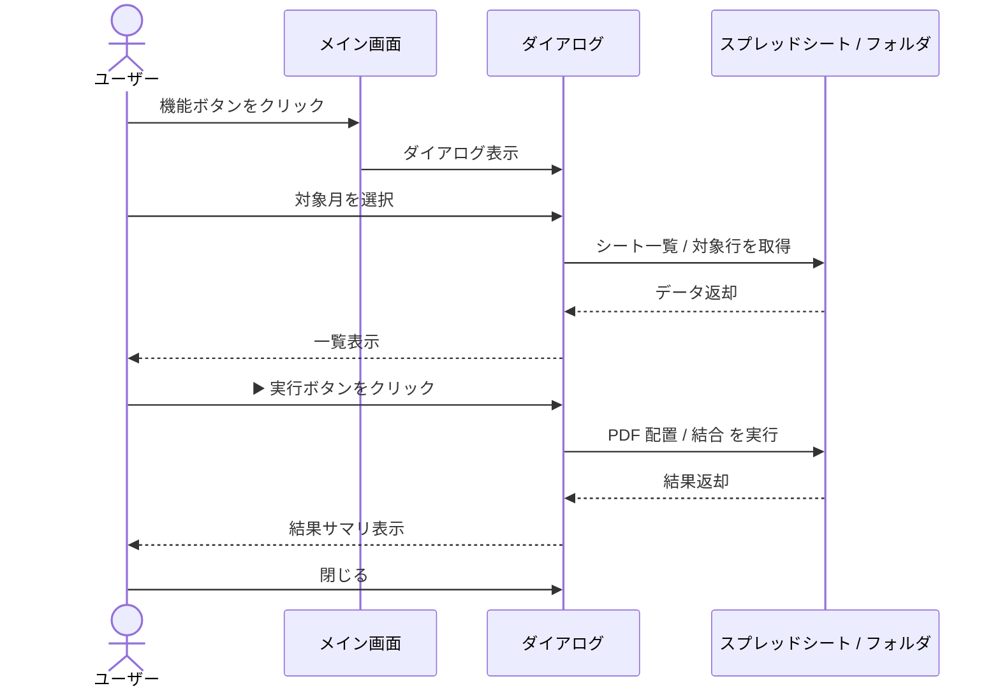

# 画面全体の説明

## メイン画面の構成

アプリを起動すると、業務フロー順に **5 つのボタン** が並んだメイン画面が表示されます。

  
Wiseman PDF ツール

  

    <a class="app-btn" href="#/guide/ex-extractor">1ex_ ファイル変換 + 振り分け</a>
    <a class="app-btn" href="#/guide/checklist-b">2B: 運動機能向上計画書 自動配置</a>
    <a class="app-btn" href="#/guide/checklist-c">3C: 経過報告書 自動配置</a>
    <a class="app-btn" href="#/guide/facility-merger">4事業所フォルダ一括結合</a>
    <a class="app-btn app-btn-settings" href="#/guide/settings">5設定</a>
  

> 💡 **このマニュアル上では**、上記の各ボタンをクリックすると **対応する機能の説明ページに飛びます**（マウスを乗せるとボタンが浮き上がります）。  
> **実機アプリでは**、ボタンをクリックすると専用のダイアログ（小さな別ウィンドウ）が開いて、その機能の操作画面が表示されます。

---

## 業務フロー全体像

毎月の業務は、おおよそ次の流れで実施します。各ボタンはこのフローに沿って並んでいます。

| 順序 | ボタン | やること |
|:---:|:------|:--------|
| 1 | **① ex_ファイル変換 + 振り分け** | Wiseman から出力したファイルを PDF にし、事業所別に振り分ける |
| 2 | **② B: 運動機能向上計画書 自動配置** | 該当月のモニタリング対象利用者の計画書を配置 |
| 3 | **③ C: 経過報告書 自動配置** | 該当月の担当者ごとの経過報告書を配置 |
| 4 | **④ 事業所フォルダ一括結合** | 事業所ごとに PDF を 1 つに結合（FAX 送信用） |

**⑤ 設定** は事前準備や設定変更時のみ使用します（普段は触りません）。

---

## ダイアログの共通レイアウト

B と C のダイアログは共通の操作パターンです。

  
B / C ダイアログ（例）

  

    

      
🔄 シート一覧更新

      
📥 対象行を読込

      
⚙️ 設定...

    

    
📊 対象行の一覧表示エリア（利用者名 / ステータス 等）

    

      
▶️ 実行

      
閉じる

    

  

| 操作ボタン | 役割 |
|-----------|------|
| **🔄 シート一覧更新** | スプレッドシートから最新のシート一覧（=月別タブ）を取得 |
| **📥 対象行を読込** | 選択中のシートから対象となる行を抽出して表示 |
| **⚙️ 設定...** | スプレッドシート ID 等の設定変更 |
| **▶️ 実行** | 抽出された全行に対して PDF 配置を実行 |
| **閉じる** | ダイアログを閉じてメイン画面に戻る |

---

## 操作の基本パターン

各機能は次の 3 ステップで完結します。

---

## 次のステップ

最初は **[① ex_ファイル変換 + 振り分け](ex-extractor.md)** から始めるのがおすすめです。

サイドバーから各機能のページに移動できます。

  <a href="#/guide/ex-extractor" style="text-decoration:none;">
    

      
📄

      
<strong>① ex_ファイル変換</strong>

    

  </a>
  <a href="#/guide/checklist-b" style="text-decoration:none;">
    

      
🏃

      
<strong>② B 自動配置</strong>

    

  </a>
  <a href="#/guide/checklist-c" style="text-decoration:none;">
    

      
📋

      
<strong>③ C 自動配置</strong>

    

  </a>
  <a href="#/guide/facility-merger" style="text-decoration:none;">
    

      
📚

      
<strong>④ 事業所フォルダ結合</strong>

    

  </a>
  <a href="#/guide/settings" style="text-decoration:none;">
    

      
⚙️

      
<strong>⑤ 設定</strong>

    

  </a>

