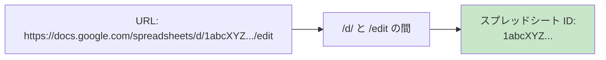
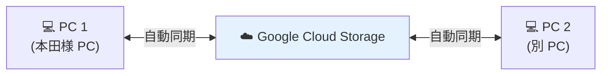

# ⑤ 設定

スプレッドシート ID、対象月、フォルダパス等の設定変更を行います。

## いつ使うか

<div style="display:flex;gap:0.8em;margin:1em 0;flex-wrap:wrap;">
  <div style="background:#f5f5f5;border:1px solid #ccc;border-radius:6px;padding:0.8em 1em;flex:1;min-width:180px;">
    🆕 <strong>初期セットアップ時</strong>
  </div>
  <div style="background:#f5f5f5;border:1px solid #ccc;border-radius:6px;padding:0.8em 1em;flex:1;min-width:180px;">
    🔄 <strong>スプレッドシート切替時</strong>
  </div>
  <div style="background:#f5f5f5;border:1px solid #ccc;border-radius:6px;padding:0.8em 1em;flex:1;min-width:180px;">
    👥 <strong>担当者マッピング更新時</strong>
  </div>
  <div style="background:#f5f5f5;border:1px solid #ccc;border-radius:6px;padding:0.8em 1em;flex:1;min-width:180px;">
    📁 <strong>フォルダ構成変更時</strong>
  </div>
</div>

> 普段の業務では触りません。

---

## 操作手順

<div class="step-card">
  <span class="step-card-num">1</span><strong>ボタンをクリック</strong><br>
  メイン画面の <strong>「⑤ 設定」</strong> ボタンをクリック。
</div>

<div class="step-card">
  <span class="step-card-num">2</span><strong>設定ダイアログが開く</strong><br>
  設定項目が一覧で表示されます。
</div>

<div class="step-card">
  <span class="step-card-num">3</span><strong>設定項目を変更</strong>
</div>

| 項目 | 説明 |
|------|------|
| 📊 **スプレッドシート ID** | Google スプレッドシートの ID（URL の `/d/` と `/edit` の間の文字列） |
| 📅 **対象月のデフォルト値** | B/C ダイアログで初期選択される月 |
| 📂 **FAX 事業所ルート** | 振り分け先のルートフォルダ（通常は Tera-station の `03.FAX(事業所)`） |
| 📁 **カルテルート** | 月別 PDF の取得元フォルダ |
| 🏷️ **alias 設定** | 事業所名の表記揺れマッピング |
| 👥 **担当者マッピング** | 担当者名 → xlsx パスの対応 |

<div class="step-card">
  <span class="step-card-num">4</span><strong>💾 変更を保存</strong><br>
  設定変更後、<strong>「保存」</strong> ボタンをクリックします。<br>
  B/C ダイアログを開いている場合、スプレッドシート ID 変更時は自動的に再読み込みが促されます。
</div>

<div class="step-card">
  <span class="step-card-num">5</span><strong>キャンセル</strong><br>
  変更を破棄する場合は <strong>「キャンセル」</strong> ボタン。
</div>

---

## 📊 スプレッドシート ID の見つけ方



例:

```text
https://docs.google.com/spreadsheets/d/1abcXYZ.../edit#gid=0
                                       ↑↑↑↑↑↑↑
                                  この部分が ID
```

---

## ☁️ GCP 同期機能

設定の一部（事業所マッピング、担当者マッピング等）は **Google Cloud Storage** に自動同期されます。



- 別 PC で同じ設定を共有可能
- 同期状態は設定画面に表示されます

---

## 📝 設定ファイルの場所

設定は `config/default.toml` に保存されます。

> ⚠️ 直接編集することも可能ですが、**通常は設定画面から変更** してください。  
> 起動中に直接編集しても、起動時に読み込まれた値が優先されます。

---

## よくある質問

> **Q. スプレッドシート ID を間違えた**  
> A. 設定画面から再入力。B/C ダイアログを開いていれば自動的に再読み込みが促されます。

> **Q. config/default.toml を直接編集してもよい？**  
> A. 起動中は **起動時に読み込まれた値が優先** されます。編集後はアプリ再起動が必要です。

> **Q. GCP 同期が失敗する**  
> A. インターネット接続を確認してください。それでもダメな場合は開発担当へ連絡。

---

## 関連

- 設定変更後にエラーが出る → [トラブルシューティング](../troubleshooting.md)
- GCP 同期について → [FAQ](../faq.md)
